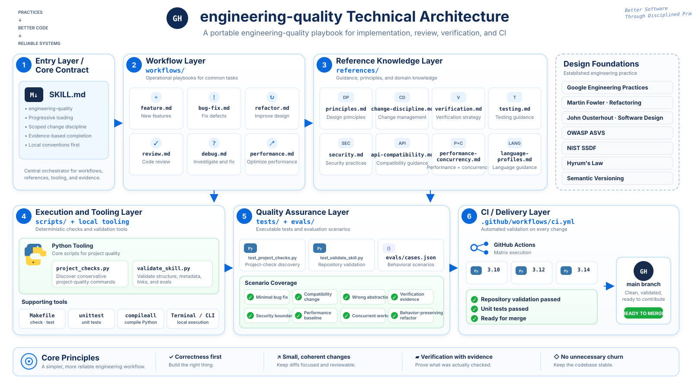

<div align="center">

# engineering-quality

**Ship patches you can defend.**

`read the repo → model the contract → patch narrowly → try to break it → inspect the diff → show the evidence`

[](https://github.com/GeoGeekLab/engineering-quality/actions/workflows/ci.yml)
[](https://github.com/GeoGeekLab/engineering-quality/releases)
[](LICENSE)
[](.github/workflows/ci.yml)
[](#codex--one-instruction)
[](#claude-code)
[](#chatgpt)

A portable engineering playbook for coding agents and humans who want changes that are correct, local, reviewable, and provable.

</div>

<p align="center">
  
</p>

## The idea

Code can compile and still be wrong.

Tests can pass and still miss the contract.

A diff can look clean and still break compatibility, leak data, race under load, or quietly widen scope.

So this project treats engineering quality less like taste and more like a protocol:

```text
observe
  ↓
infer the local contract
  ↓
change the smallest coherent surface
  ↓
attack the change with the right checks
  ↓
read the diff like a reviewer
  ↓
separate proof from belief
```

The core rules are intentionally boring:

- correctness beats elegance;
- repository-local conventions beat generic taste;
- public behavior is a contract until proven otherwise;
- tests should encode behavior, not implementation trivia;
- security, compatibility, concurrency, and operability count as correctness;
- machines should check what machines can check;
- "looks good" is not evidence.

Function length, coverage, complexity, and diff size are signals. They are not commandments.

> **Less taste. More invariants.**

## Install

### Codex — one instruction

Paste this into Codex:

```text
$skill-installer Install engineering-quality from https://github.com/GeoGeekLab/engineering-quality
```

That is the preferred Codex path: the built-in skill installer fetches the repository and installs the skill in a Codex-recognized location.

<details>
<summary><strong>Codex alternatives: cross-agent CLI and manual install</strong></summary>

Install globally with the cross-agent `skills` CLI:

```bash
npx -y skills@latest add GeoGeekLab/engineering-quality -g -a codex -y
```

Or install manually for the current user:

```bash
git clone https://github.com/GeoGeekLab/engineering-quality.git ~/.agents/skills/engineering-quality
```

Codex discovers skills from `.agents/skills` locations. If a newly installed skill is not visible immediately, restart the Codex session.

</details>

### Claude Code

Install globally with the cross-agent `skills` CLI:

```bash
npx -y skills@latest add GeoGeekLab/engineering-quality -g -a claude-code -y
```

Manual installation:

```bash
git clone https://github.com/GeoGeekLab/engineering-quality.git ~/.claude/skills/engineering-quality
```

Start a new Claude Code session after installation if the skill is not picked up by the current session.

### ChatGPT

For the cleanest installation, use the packaged ZIP attached to the latest GitHub Release:

**[Open the latest release](https://github.com/GeoGeekLab/engineering-quality/releases/latest)**

For a development checkout, build the same package locally:

```bash
make package
```

Then upload `dist/engineering-quality-<version>.zip` through the ChatGPT Skills interface available to your workspace.

> [!NOTE]
> ChatGPT Skills availability depends on the workspace plan, admin settings, and current product availability.

See [docs/compatibility.md](docs/compatibility.md) for the maintained host compatibility matrix and installation details.

Platform references: [Codex Skills](https://developers.openai.com/docs/build-skills) · [ChatGPT Skills](https://help.openai.com/en/articles/20001066) · [Claude Skills](https://www.anthropic.com/research/skills) · [skills CLI](https://github.com/vercel-labs/skills)

## Runtime

```text
RECON → CONTRACT → CHANGE → VERIFY → REVIEW → EVIDENCE
```

Think of it as a tiny engineering VM:

| Stage | What it does |
| --- | --- |
| **RECON** | Read before writing. Discover architecture, conventions, checks, ownership, and sharp edges. |
| **CONTRACT** | Define what must change, what must not change, and what would prove success. |
| **CHANGE** | Make the smallest coherent patch that satisfies the contract. |
| **VERIFY** | Try to falsify the patch with focused tests, static checks, builds, and risk-specific probes. |
| **REVIEW** | Inspect the diff for correctness, compatibility, security, concurrency, maintainability, and accidental scope. |
| **EVIDENCE** | Report what was executed, what was only reasoned about, and what remains unverified. |

No "done" until the evidence matches the claim.

## Repository map

```text
engineering-quality/
├── SKILL.md                     # bootloader: invariants + routing
├── VERSION                      # canonical release version
├── workflows/
│   ├── feature.md               # add behavior
│   ├── bug-fix.md               # restore behavior
│   ├── refactor.md              # move code without moving the contract
│   ├── review.md                # hunt failure modes
│   ├── debug.md                 # reduce uncertainty
│   └── performance.md           # measure before mythology
├── references/
│   ├── principles.md
│   ├── change-discipline.md
│   ├── verification.md
│   ├── testing.md
│   ├── security.md
│   ├── api-compatibility.md
│   ├── performance-concurrency.md
│   └── language-profiles.md
├── scripts/
│   ├── project_checks.py
│   ├── validate_skill.py
│   ├── package_skill.py
│   ├── release_check.py
│   └── release_notes.py
├── tests/
├── evals/
│   ├── cases.json
│   ├── schema.json
│   └── README.md
├── docs/
│   ├── compatibility.md
│   ├── foundations.md
│   ├── release.md
│   └── assets/
│       └── architecture.svg
└── .github/workflows/
    ├── ci.yml
    └── release.yml
```

### Progressive loading

`SKILL.md` is the bootloader, not the encyclopedia.

It loads the invariant set first—correctness, scoped changes, local conventions, verification, diff review—then routes into the narrowest workflow and reference set needed for the task.

Security guidance appears when trust boundaries matter. Compatibility guidance appears when public contracts move. Performance and concurrency guidance stay out of the context until they are actually relevant.

Small context. Deep branches.

## Tools, not vibes

### Discover project checks

Inspect a repository and print conservative quality commands without running them:

```bash
python scripts/project_checks.py /path/to/repository
```

Discovery is read-only: the helper prints candidate commands and does not execute them or install dependencies.

Command names such as `test`, `check`, or `lint` are not a security boundary. Make targets, package scripts, test runners, build tools, wrappers, plugins, and compiler hooks may execute arbitrary repository-controlled code.

Only after you have established trust in the repository, execution requires both flags:

```bash
python scripts/project_checks.py /path/to/repository --run --trust-repository
```

The explicit trust flag is intentional. Running checks can access inherited environment variables, local files, and network resources and can cause side effects.

The helper recognizes common project signals across Python, JavaScript/TypeScript, Go, Rust, JVM projects, .NET, Swift, Dart/Flutter, Make-based projects, and repository-defined scripts.

### Validate this repository

Requires Python 3.10 or newer.

```bash
make check
```

The validation pipeline treats the repository itself as an executable contract:

```text
repository integrity
  ├── skill metadata + local links
  ├── VERSION + CHANGELOG consistency
  ├── evaluation fixtures + schema
  ├── Python compilation
  ├── unit tests
  ├── deterministic package verification
  └── release-readiness invariants
```

CI runs that contract across Python **3.10**, **3.12**, and **3.14**, then builds and verifies the distribution artifact.

### Build the artifact

```bash
make package
```

Produces:

```text
dist/
├── engineering-quality-<version>.zip
└── engineering-quality-<version>.zip.sha256
```

The ZIP contains only the runtime skill payload plus an internal `MANIFEST.sha256`.

Tests, CI configuration, README content, and release tooling stay outside the runtime artifact on purpose.

Tagged releases are automated. See [docs/release.md](docs/release.md).

## Quality model

Not this:

```text
quality = more abstraction + more comments + more tests + more patterns
```

Closer to this:

```text
quality =
    correctness
  + clarity
  + compatibility
  + security
  + verifiability
  - accidental complexity
  - unnecessary churn
```

It is not a score. It is an ordering of concerns.

### Correctness > aesthetics

A beautiful implementation of the wrong behavior is still a bug.

### Coherent diff > ambitious cleanup

A patch should have one understandable reason to exist.

Tests, migrations, and documentation required by that reason belong in the patch. Drive-by cleanup does not.

### Local architecture > imported doctrine

The repository already has a language: naming, error semantics, abstractions, test shape, tooling, and release conventions.

Read it before teaching it a new accent.

### Evidence > confidence

```text
Verified     = executed and observed
Reasoned     = supported by inspection
Not verified = relevant check not run, with a concrete reason
```

Reasoning matters. Execution evidence matters more.

### Smells are interrupts, not exceptions

Long functions, duplicated code, broad diffs, low coverage, and high complexity should make you look closer.

They do not automatically make the code wrong.

The useful question is not "which rule was violated?"

It is:

```text
what failure mode is hiding here?
```

Coupling? Obscured invariants? Unsafe boundaries? Compatibility debt? Unverifiable behavior? Operational surprise?

Find the bug behind the smell.

## Review protocol

Review is not a style referendum.

Findings are classified by concrete impact:

| Severity | Meaning |
| --- | --- |
| **Blocker** | Incorrect behavior, data loss, security exposure, broken contract, or reliably failing verification. |
| **Major** | A material problem likely under realistic conditions or a significant maintenance/operational risk. |
| **Minor** | A bounded issue affecting clarity, resilience, test quality, or consistency. |
| **Note** | Optional improvement, question, or follow-up. |

A useful review comment should be able to answer:

```text
what can fail?
under what condition?
why does this diff make that possible?
what evidence would close the finding?
```

Style disagreement alone has no severity.

## Failure modes this tries to kill

```text
"the tests passed, so we're done"
"while I'm here, I'll clean up these 14 files"
"this abstraction is more elegant"
"coverage went up"
"the linter is green"
"works on my machine"
"probably backward compatible"
"should be thread-safe"
"looks good"
```

None of those statements is useless.

None of them is sufficient evidence by itself.

## Design foundations

The playbook borrows from established engineering practice without turning any one source into scripture:

- [Google Engineering Practices](https://google.github.io/eng-practices/) — reviewability, small coherent changes, and codebase health.
- [Martin Fowler](https://refactoring.com/) — refactoring, code smells, testing, and evolutionary design.
- [A Philosophy of Software Design](https://web.stanford.edu/~ouster/cgi-bin/aposd.php) — complexity, information hiding, and deep modules.
- [OWASP ASVS](https://owasp.org/projects/asvs/) and [NIST SSDF](https://csrc.nist.gov/Projects/ssdf) — structured security requirements and secure development practice.
- [Hyrum's Law](https://www.hyrumslaw.com/) and [Semantic Versioning](https://semver.org/) — observable behavior and compatibility.
- Official ecosystem guidance including [PEP 8](https://peps.python.org/pep-0008/), [Go Code Review Comments](https://go.dev/wiki/CodeReviewComments), and the [Rust API Guidelines](https://rust-lang.github.io/api-guidelines/).

See [docs/foundations.md](docs/foundations.md) for the maintained source map.

## Contributing

Do not add rules because they sound professional.

Add them because they kill a real failure mode.

Before proposing one, ask:

```text
What breaks without this rule?
Is it always true, or conditional?
Can a deterministic tool enforce it better?
Does it belong in the bootloader or an on-demand reference?
Can we write an eval that catches its absence?
```

If the answer is fuzzy, the rule probably is too.

See [CONTRIBUTING.md](CONTRIBUTING.md).

## License

[MIT](LICENSE)

---

<div align="center">

**Read the repo. Respect the contract. Keep the patch tight. Prove the result.**

`works ≠ verified`

</div>
